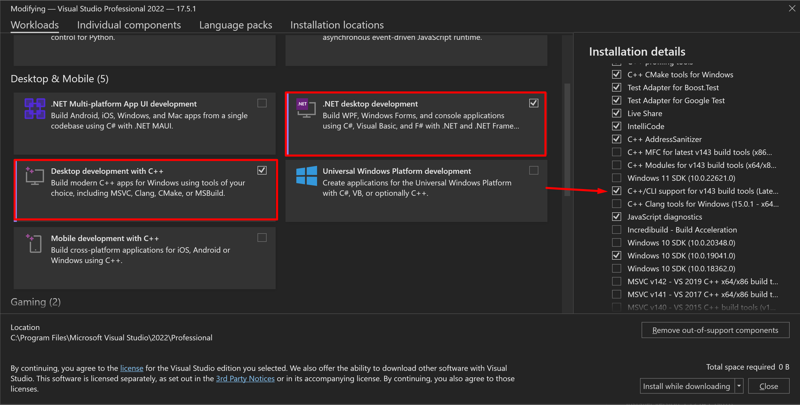
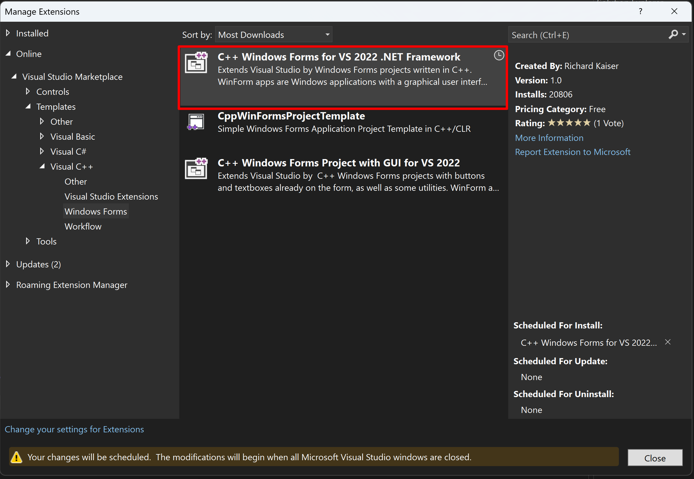
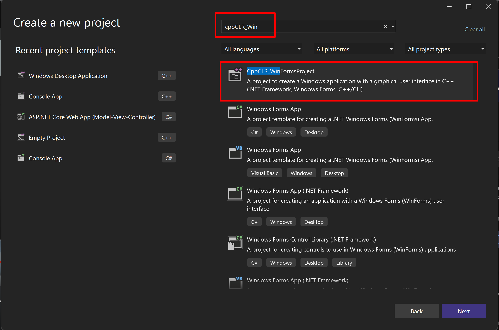

# Election Data Retrieval Using Max Heap and B Trees

## Problem
Election data is stored in tabular format with the candidate names being used as column names for various fields. This makes it difficult to sort and/or summarize election data by candidate. 

For example: if you wanted to find voter data on a candidate's top 10 strongest counties in the United States, it would take a lot of effort to refactor the dataset and then create the desired summarization of data.

## Motivation
Politicians may struggle with existing data to understand how to most efficiently use their time and resources when campaigning, and specifically what locations in the US to focus on. Our program would help by quickly showing them which counties they are the most successful in and likely to gain votes in. It provides them more targeted information to work with, showing them how the public is perceiving them in that area of the US.

## Features
Our application will import the data in its raw format and then convert it into an effective data structure that will allow for sorting and analyzing voter data. The user interface will provide a search field for the candidate’s name, search pattern options and return the results into a table with a relevant picture of the candidate that was searched. The time it takes to retrieve the data by both data structures will be displayed and thus, easily able to be compared. We’ll know we have succeeded if our program can accurately output the top n counties for each candidate in a trivial amount of time (<5 seconds).

## Data
<b>Election Data:</b> https://think.cs.vt.edu/corgis/csv/election/

<b>Columns:</b>
- County: string
- State: string
- Party: string
- Number of Votes: Int
- Percent of Votes: Double

Data will be unpivoted to match these columns plus converting the column heading that includes the candidates name to a column used for searching across the dataset.

## Tools
<b>Languages:</b> C++17

<b>Tools / Frameworks:</b> Visual Studio 2022, C++/CLI (to develop Windows Forms), .Net Desktop Development, Justinmind (to create the wireframe/UI visual)

<b>Setup Steps:</b>

- Step 1: Install Visual Studio 2022 Community Edition
  - Step 1a: Enable the following options:
        
- Step 2: Enable the C++ WinForms extension
  - Step 2a: From the top menu bar, select: Extensions > Manage Extensions
  - Step 2b: From the manage extensions menu, select: Online > Visual Studio Marketplace > Templates > Visual C++ and then select the template shown here:
    
  - Steb 2c: After extension has been selected, close visual studio to intiate update.
- Step 3: Verify extension was installed successfully and all dependancies exist by test creating a new project of the type displayed here:
    

> **Note**
>
> If you are able to create and run an example project using this template then your environment is properly configured to work on this project.

## Visuals

## Strategy
B Tree and Max heap to store and retrieve the data, we would have a separate data structure for each candidate, and each node would represent a county. That is our current plan to implement and solve this problem, but if we find a more efficient representation either in terms of time or space, we will alter our design to account for that.

B Trees are n-ary trees in which each node can contain multiple key-value pairs, and data is stored in both the leaves and non-leaf nodes. The data is sorted according to their keys, to facilitate O(log n) insertion and retrieval where n is the number of nodes.

Max Heaps are Trees in which the nodes are sorted by their keys in descending order, with every node being greater than all of its children. The structure is inherently self-balancing, and facilitates extremely easy retrieval of the largest value, as it is always the root value. Insertion and retrieval (including heapifying)  in this structure is also O(log n), so we will see which data structure truly will be the fastest in performing the task of retrieving election data.

## Distribution of Responsibility and Roles
- <b>David Baumgarten:</b> Documentation, Github setup, Project initialization, Dataset loading, B Tree Impl
- <b>Kayleigh Yu:</b> User Interface design, Demo Recording, B Tree and Max Heap Implementation
- <b>Xiya Zhou:</b> Define coding standards, Unit Testing, Max Heap Implementation

## References
Creating a C++ Windows Form using Microsoft Visual Studio 2022
https://www.youtube.com/watch?v=zv8DkkhBNR0
